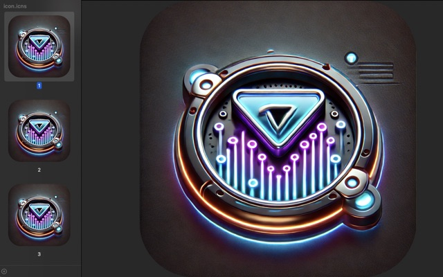

# Icon Maker

[](https://semver.org)

<p align="center">
  
</p>

Icon Maker is a simple yet powerful tool for macOS that generates both macOS (.icns) and Windows (.ico) icon files from a single PNG image. It creates icons with rounded corners for a polished look.

## Features

- Generates macOS (.icns) and Windows (.ico) icon files
- Creates icons with rounded corners
- Supports multiple icon sizes for both platforms
- Easy to use command-line interface

## Prerequisites

Before you can use Icon Maker, you need to install ImageMagick. The easiest way to do this on macOS is using Homebrew.

1. Install Homebrew (if you haven't already):

   ```
   /bin/bash -c "$(curl -fsSL https://raw.githubusercontent.com/Homebrew/install/HEAD/install.sh)"
   ```

2. Install ImageMagick:
   ```
   brew install imagemagick
   ```

## Installation

1. Clone this repository or download the `icns.sh` script.
2. Make the script executable:
   ```
   chmod +x iconmaker.sh
   ```

## Usage

1. Open Terminal and navigate to the directory containing the `iconmaker.sh` script.
2. Run the script with your PNG file as an argument:
   ```
   ./iconmaker.sh path/to/your/imgage_file.png
   ```
3. The script will ask you to choose your platform(s):
4. According to your choices, the script will generate the following items in the same directory as your original PNG:
   - `imgage_file.icns` (macOS icon file)
   - `imgage_file.ico` (Windows icon file)
   - a directory `linux_icons`

## How It Works

The script performs the following steps, according to your choices:

1. Creates temporary directories for macOS and Windows icons
2. Generates rounded corner images for all required sizes
3. Creates the .icns file for macOS using ImageMagick the `iconutil` commands
4. Creates the .ico file for Windows using ImageMagick
5. Creates the directory containing the .png files for Linux using ImageMagick
6. Cleans up temporary files

## License

This project is open source and available under the [MIT License](LICENSE).

## Acknowledgements

This script was created to simplify the process of generating cross-platform icon files. Special thanks to the ImageMagick community for their powerful image manipulation tools.
